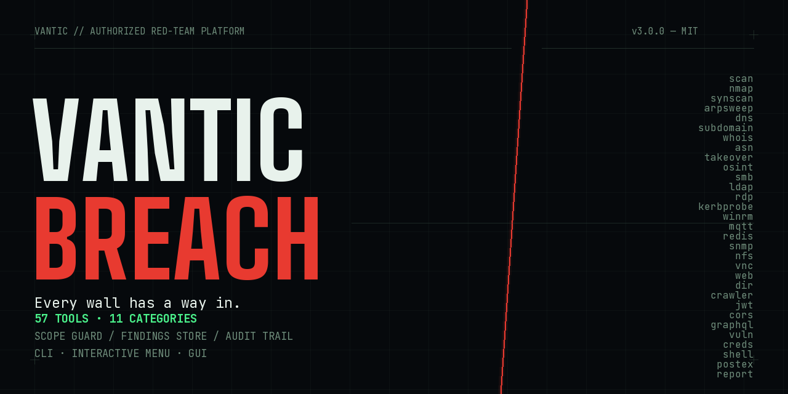
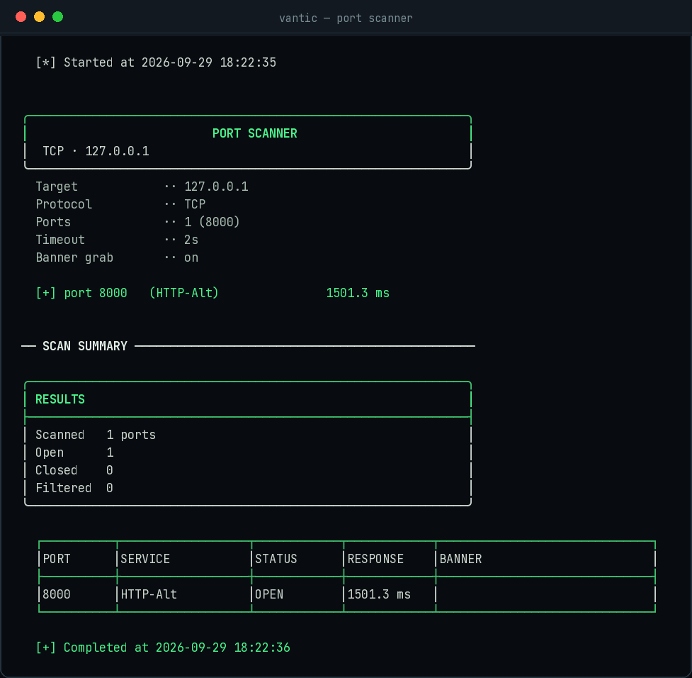
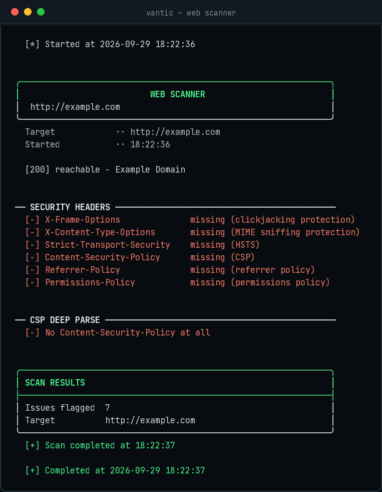

<p align="center">
  
</p>

<h1 align="center">Vantic Breach</h1>

<p align="center">
  <strong>Every wall has a way in.</strong><br>
  A full-suite authorized red-teaming toolkit — 57 tools, one engagement platform, three front ends.
</p>

<p align="center">
  
  
  
  
</p>

---

## ⚠️ Legal disclaimer

Vantic Breach is built for **authorized security testing only** — engagements where you have
written permission from the system owner (pentest contracts, bug-bounty scope, or your own lab).

Unauthorized access to computer systems is a **crime** in most jurisdictions. Scanning, brute-forcing,
or probing systems you don't own and aren't authorized to test is illegal, and it is strictly
prohibited by the license of this project. **You are solely responsible for how you use this
software.** The full legal terms live in [LICENSE](LICENSE).

---

## What is it?

Vantic Breach is a red-team toolkit that walks an engagement end to end:
**recon → discovery → enumeration → assessment → exploitation → reporting**.

It ships as a single Python project with three front ends over one engine:

| Edition | Launch | Best for |
|---------|--------|----------|
| **Interactive menu** | `python3 vantic.py` | Browsing categories → tools with guided prompts |
| **CLI** | `python3 vantic.py <tool> <args>` | Power users, scripting, automation |
| **GUI** | `python3 vantic-gui.py` | Point-and-click forms with live output |

The menu and GUI are auto-generated from each tool's own declaration, so all three
interfaces always behave identically.

Every run can be recorded against an **engagement**: a scope-enforced workspace with a
SQLite findings store, an append-only audit trail, and professional HTML reporting.
Out-of-scope targets are refused before a single packet is sent (exit code 3).

## Screenshots

| Port scanner | Web scanner |
|---|---|
|  |  |

## Requirements

- **Python 3.9+** — everything else is optional; the toolkit is stdlib-first and
  degrades gracefully with install hints when a dependency is missing.

Optional extras (recommended):

```bash
pip3 install -r requirements.txt
# paramiko + dnspython  → SSH brute, DNS/subdomain depth
# scapy                 → SYN scan, ARP sweep, DHCP, OS fingerprinting (root)
# impacket / ldap3 / pysmb → deep AD/SMB enumeration
```

## Installation

```bash
git clone https://github.com/vanticstudio/vantic-breach.git
cd vantic-breach
pip3 install -r requirements.txt   # optional but recommended
```

No build step, no config. That's the whole install.

**Windows:** install Python from python.org (tick *"Add python.exe to PATH"*),
then double-click `app/Windows app/Vantic Breach CLI.bat` — or run the commands
above in a console.

**macOS:** double-click `app/Mac app/Vantic Breach CLI.app` for a ready-to-go
terminal session.

## Quick start

```bash
# Open the interactive menu
python3 vantic.py

# Scan localhost
python3 vantic.py scan 127.0.0.1 -p 22,80,443 --banner

# DNS posture: SPF / DMARC / DKIM + SRV
python3 vantic.py dns example.com --mailsec --srv

# Web security headers + CSP deep parse
python3 vantic.py web http://example.com --headers --csp

# Subdomain enumeration (brute + passive)
python3 vantic.py subdomain example.com --brute --passive

# Machine-readable output for pipelines
python3 vantic.py --json scan 127.0.0.1 -p 443
```

Any tool takes `-h` for its full option list.

## The toolkit — 57 tools, 11 categories

| Category | Highlights |
|----------|-----------|
| **Reconnaissance** | `dns` `subdomain` `whois` `asn` `takeover` `osint` `reconapi` |
| **Discovery** | `scan` `nmap` `synscan` `arpsweep` `osfp` `netmap` `dnssweep` |
| **Internal / AD** | `smb` `smbenum` `ldap` `kerbprobe` `rdp` `winrm` `namesniff` `nbtquery` `ntlm` `ra_sweep` |
| **Services** | `enum` `smtp` `snmp` `nfs` `redis` `memcache` `mqtt` `vnc` |
| **Web analysis** | `web` `http` `dir` `crawler` `params` `jwt` `cors` `graphql` `checks` `webauth` |
| **Credentials** | `creds` `defaults` `mailauth` |
| **Gateway / infra** | `gateway` `upnp` `dhcp` |
| **Vulnerabilities** | `vuln` — TLS, Heartbleed, cert audit, CVE hints |
| **Exploitation** | `shell` — reverse-shell payload generator (9 languages) |
| **Post-exploitation** | `postex` — read-only privesc audit |
| **Analysis & reporting** | `sniff` `report` `diff` `jobs` |

Wordlists for directories, subdomains, passwords, and vendor default credentials
are bundled in [`wordlists/`](wordlists/).

## Engagements — scope, findings, audit

```bash
python3 vantic.py engage new acme --client 'Acme Corp' --auth-ref 'PO-1234'
python3 vantic.py engage scope --allow-cidr 10.0.0.0/24 --allow-domain acme.com
python3 vantic.py engage use acme

# ...run any tool — enforced scope, recorded findings...
python3 vantic.py report --from-store --output report.html
```

- **Scope guard** — allow/deny lists, deny wins; refusals exit with code 3
- **Findings store** — deduplicated, severity-rated, CVSS v3.1 scoring
- **Audit trail** — append-only JSONL of every run (argv, exit code, duration)
- **Reports** — executive summary + inline SVG severity charts, print-to-PDF ready

## Documentation

| Doc | Contents |
|-----|----------|
| [QUICKSTART.md](QUICKSTART.md) | Fast onboarding and common commands |
| [DOCS.md](DOCS.md) | Full tool catalog, architecture, extension guide |
| [BUILD.md](BUILD.md) | Packaging: from source to signed apps on macOS & Windows |
| [STATUS.md](STATUS.md) | Per-subsystem status and known limitations |
| [LICENSE](LICENSE) | MIT license + legal disclaimer |

## License

MIT — free for personal and commercial use. See [LICENSE](LICENSE).

Use it only where you're allowed. **Don't be the reason this repo gets taken down.**

---

<p align="center">
  <strong>Vantic Breach v3.0.0</strong> · <em>Every wall has a way in.</em><br>
  Red Teaming Tool Application · by Vantic
</p>
